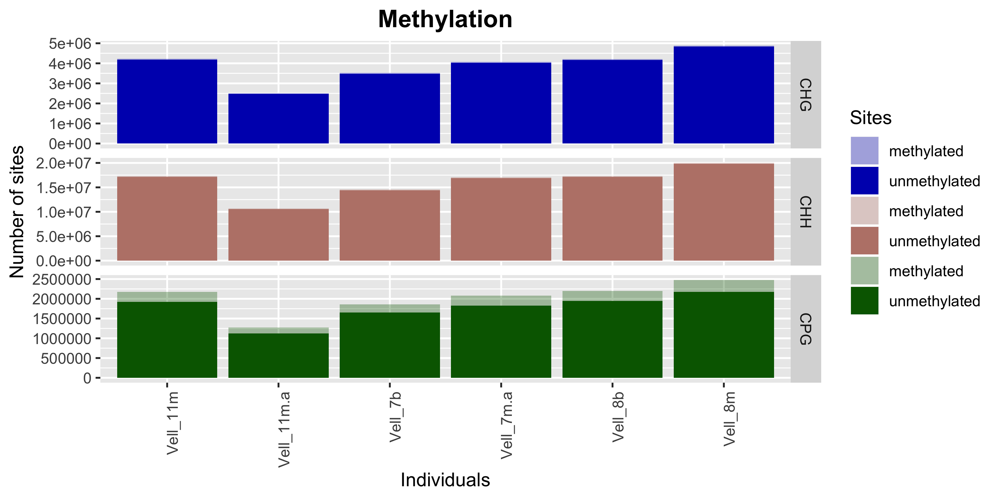
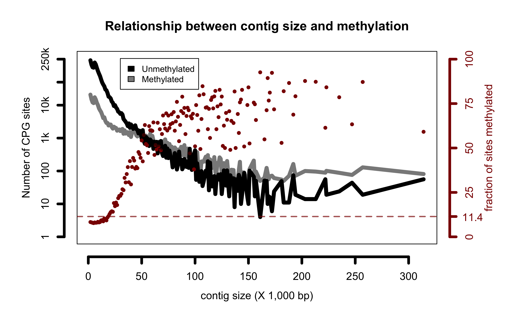

```{r setup, include=FALSE}
knitr::opts_chunk$set(echo = F)
```

## Bismark summary data  
* Data were analysed with [Bismark](https://www.bioinformatics.babraham.ac.uk/projects/bismark/).  
* 2.5 M sequences were analysed per individual.
* Sequences were first trimmed for quality, then aligned against the *Venustaconcha ellipsiformis* reference genome described [here](https://academic.oup.com/gbe/article/10/7/1637/5034436) and available [here](https://www.ncbi.nlm.nih.gov/genome/9281?genome_assembly_id=395592).


```{r summary,eval = T}
bismark_summary_report = read.table("../data/bismark_summary_report.txt",header = T, stringsAsFactors = F,sep = "\t")
bismark_summary_report[,1] = sapply(strsplit(bismark_summary_report[,1],split = "_R1"),'[',1)
colnames(bismark_summary_report)[9:15] = c("Total_Cs","mCpG","unCpG","mCHG","unCHG","mCHH","unCHH")
colnames(bismark_summary_report)[2:3] = c("Total_seq","align_seq")
knitr::kable(bismark_summary_report[,c(1:3,9:15)],digits =1,caption = "Bismark alignment report")
```

# Barplots  
* This is a barplot of the methylated and unmethylated fraction for CPG, CHG and CHH sites. As we can also see from the
previous table, about 1% of CHG or CHH sites are methylated, compared to ~11-12% of CpG sites.
* Number of sites (y-axis) varry because different number of sequences were filtered out with [Trimmomatic](http://www.usadellab.org/cms/?page=trimmomatic).

```{r bargraphs, fig.cap= "",eval = T}
  
```

# Contig size vs methylation
* There appears to be a spurious correlation between the fraction of methylated C and contig length.  
* Here, I first counted the number of methylated and unmethylated site depending on the size of the contig they were found in (contigs were binned in increments of 1,000bp. So bin #1 = CpG sites found in contig of size 1,000-2,000bp, bin #2 = 2,001-3,000bp, etc... to the largest contig [311,000 bp]).
* Red dots are the ratio of methylated / (methylated+unmethylated). 
* Most contigs are small (mean = 6,312 bp) and most methylated CpG are found on small contigs. Yet there is a strong trend that for larger contigs,
the fraction of CpG methylated rises subtantially (variation also increases as a function of contig size, but this is because there are way fewer of the large contigs).
* Right now, I don't have a good explanation (either technical, or biological) for this pattern.
* Dotted horizontal line is the overall mean fraction of methylated CpG sites (11.4%)


```{r contig_size, fig.cap= "",eval = T}
  
```
